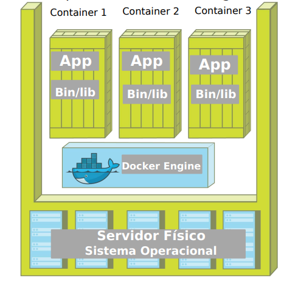
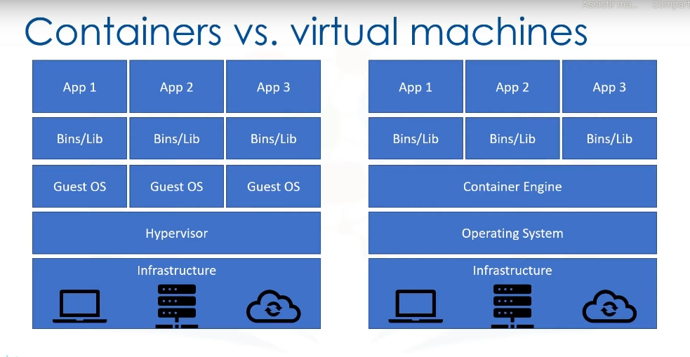

# Docker
<p align="center">
  
</p>

## Sobre Docker
É uma ferramenta que se apoia em recursos existentes no kernel, inicialmente Linux, para isolar
a execução de processos. As ferramentas que o Docker traz são basicamente uma camada de
administração de containers, baseado originalmente no LXC.

<p align="center">
  
</p>

Alguns isolamentos possíveis: 
* Limites de uso de memória
* Limites de uso de CPU
* Limites de uso de I/O
* Limites de uso de rede
* Isolamento da rede (que redes e portas são acessíveis)
* Isolamento do file system
* Permissões e Políticas
* Capacidades do kernel

### DOCKER *vs* VMs
O Docker tende a utilizar menos recursos que uma VM tradicional, um dos motivos é não precisar de
uma pilha completa como vemos em Comparação VMs × Containers. O Docker utiliza o mesmo
kernel do host, e ainda pode compartilhar bibliotecas.
Mesmo utilizando o mesmo kernel é possível utilizar outra distribuição com versões diferentes das
bibliotecas e aplicativos.

<p align="center">
  
</p>

Todas as imagens são linux, apesar do host poder ser qualquer SO que use ou emule um kernel
linux, as imagens em si serão baseadas em linux.
Não é possível usar um kernel diferente do host, o Docker Engine estará executando sob
uma determinada versão (ou emulação) do kernel linux, e não é possível executar uma versão
diferente, pois as imagens não possuem kernel.


### IMAGEM
Uma imagem Docker é a materialização de um modelo de um sistema de arquivos, modelo este
produzido através de um processo chamado build.
Esta imagem é representada por um ou mais arquivos e pode ser armazenada em um repositório

### CONTAINER
Container é o nome dado para a segregação de processos no mesmo kernel, de forma que o processo
seja isolado o máximo possível de todo o resto do ambiente.
Em termos práticos são File Systems, criados a partir de uma "imagem" e que podem possuir
também algumas características próprias.

#### ENTENDENDO MELHOR

Utilizando uma analogia com OOP, podemos comparar um container a um objeto (instância),
enquanto a imagem seria uma classe (modelo).

Toda imagem (bem como os containers) possuem um identificador único em formato hash usando
sha256. Porém seu uso não é muito prático, então para simplificar isto o docker utiliza uma tag para
identificar imagens.
A tag normalmente é formada por um nome, seguido de : dois pontos e depois uma versão. É
extremamente comum utilizar uma versão chamada latest para representar a versão mais atual.


## Comandos

### IMAGEM

#### BAIXAR IMAGEM (SEMPRE PASSAR A TAG DE VERSAO)

```
docker pull [IMAGEM]:[TAG]
```

#### ENVIAR A IMAGEM (SEMPRE PASSAR A TAG DE VERSAO)

```
docker image push [IMAGEM]:[TAG]
```

#### LISTAR IMAGENS

```
docker image ls
```

#### REMOVER IMAGEM

```
docker image rm [IMAGEM] -f # nome:tag ou id
```

### CONTAINER

#### LISTAR CONTAINERS ( -a EXIBE OS CONTAINERS PARADOS TAMBEM )

```
docker container ls -a
docker ps # antiga sintaxe
```

#### CRIAR CONTAINER

```
docker run [IMAGEM]
docker run [IMAGEM] --name [NOME_CONTAINER]
docker run [IMAGEM] -d # modo daemon (background)
```

#### INICIAR CONTAINER

```
docker container start [CONTAINER] # nome:tag ou id
```

#### ENTRAR NO SHELL DO CONTAINER

```
docker exec -it [CONTAINER] sh
```

#### PARAR CONTAINER

```
docker container stop [CONTAINER] # nome:tag ou id
```

#### INSPECIONAR CONTAINER

```
docker inspect [CONTAINER] # nome:tag ou id
```

#### REMOVER CONTAINER

```
docker rm [CONTAINER] -f # nome:tag ou id
```

### REDES

> A rede padrão do docker é a **bridge**

#### LISTAR REDES

```
docker network ls
```

#### MAPEAMENTO DE PORTAS

> É possível mapear tanto portas TCP como UDP diretamente para o host, permitindo acesso através de
toda a rede, não necessitando ser a mesma porta do container. O método mais comum para este fim
é o parâmetro -p no comando docker container run, o -p recebe um parâmetro que normalmente é
composto por dois números separados por : (dois pontos). O primeiro é no host e o segundo é no
container.

```
docker run -d -p [PORTA_LOCAL]:[PORTA_CONTAINER] [IMAGEM]
docker run -d -p 8080:80 nginx:1.19.4-alpine # executa o nginx e faz o espelhamento da porta 80 (container)
para a 8080 (máquina)
```

#### CRIAR CONTAINER COM REDE DO HOST

```
docker run --net host [IMAGEM]
```

#### INSPECIONAR REDE

```
docker inspect network bridge
docker inspect network host
docker inspect network none
```

#### CRIAR REDE

```
docker network create --driver bridge [REDE]
```

#### CONECTAR SUBREDES

```
docker network connect bridge [CONTAINER] # considerando que o container esta em outra rede
```

#### DESCONECTAR SUBREDES

```
docker network disconnect bridge [CONTAINER]
```

### VOLUMES

#### MAPEAR VOLUME

> É possível mapear tanto diretórios no host como entidades especiais conhecidas como volumes
para diretórios no container. Por enquanto vamos nos concentrar no mapeamento mais simples,
uma diretório no host para um diretório no container. O método mais comum para este fim é o
parâmetro -v no comando docker container run, o -v recebe um parâmetro que normalmente é
12
composto por dois caminhos absolutos separados por : (dois pontos). Assim como diversos outros
parâmetros, o primeiro é no host e o segundo é no container.

```
docker run -v "[VOLUME_LOCAL]:[VOLUMOE_CONTAINER]"
```

#### MAPEANDO O _index.html_ PARA O NGINX

```
docker run --name nginx_alpine -d -p 8080:80 -e NGINX_ENTRYPOINT_QUIET_LOGS=1 -v "/home/fischer/Dev/docker/commands:/usr/share/nginx/html" nginx:1.19.4-alpine
```

### DOCKERFILE

> Processo para gerar uma nova imagem a partir de um arquivo de instruções. O comando docker
build é o responsável por ler um Dockerfile e produzir uma nova imagem Docker.

```
FROM nginx:1.19.4-alpine
LABEL maintainer="FischerNZ <fischerrobson@gmail.com>"
COPY . /usr/nginx/share/html
EXPOSE 80
```

Para buildar a imagem, execute: 
```
docker build -t [DOCKER_USER]/[NOME_IMAGEM]:[TAG] .
```

Caso o nome do seu arquivo seja diferente de "Dockerfile", você deverá executar:
```
docker build -f [ARQUIVO] -t [DOCKER_USER]/[NOME_IMAGEM]:[TAG] .
```

| INSTRUÇÃO  | FUNCIONALIDADE |
| ------------- |:-------------:|
| FROM      | Especifica a imagem base a ser utilizada pela nova imagem     |
| LABEL      | Especifica vários metadados para a imagem como o mantenedor. A especificação do mantenedor era feita usando a instrução específica, MAINTAINER que foi substituída pelo LABEL. |
| ENV      | Especifica variáveis de ambiente a serem utilizadas durante o build     |
| ARG      | Define argumentos que poderão ser informados ao build através do parâmetro --build-arg.     |
| COPY      | Copia arquivos e diretórios para dentro da imagem.     |
| ADD      |   Similar ao anterior, mas com suporte extendido a URLs. Somente deve ser usado nos casos que a instrução COPY não atenda.   |
|  RUN     |  Executa ações/comandos durante o build dentro da imagem.    |
| EXPOSE      | Informa ao Docker que a imagem expõe determinadas portas remapeadas no container. A exposição da porta não é obrigatória a partir do uso do recurso de redes internas do Docker. Recurso que veremos em Coordenando múltiplos containers. Porém a exposição não só ajuda a documentar como permite o mapeamento rápido através do parâmetro -P do docker container run.     |
| WORKDIR      | Indica o diretório em que o processo principal será executado.     |
| ENTRYPOINT      | Especifica o processo inicial do container     |
| CMD      | Indica parâmetros para o ENTRYPOINT    |
| USER      | Especifica qual o usuário que será usado para execução do processo no container (ENTRYPOINT e CMD) e instruções RUN durante o build.     |
| VOLUME      | Instrui a execução do container a criar um volume para um diretório indicado e copia todo o conteúdo do diretório na imagem para o volume criado. Isto simplificará no futuro, processos de compartilhamento destes dados para backup por exemplo.     |


